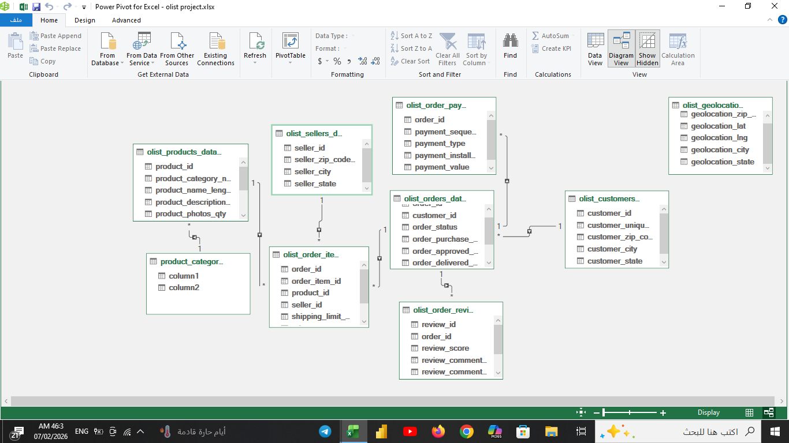
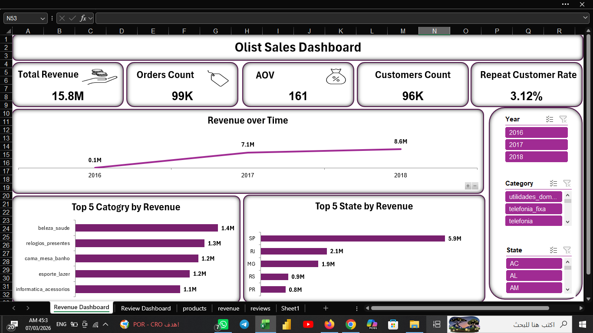
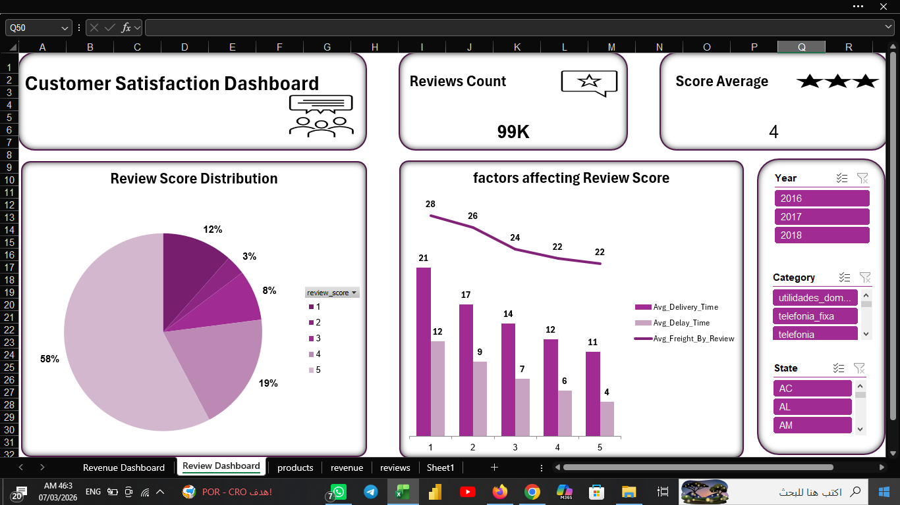

# Olist E-commerce: End-to-End Sales Performance and Customer Satisfaction Analysis

An end-to-end data analytics project using SQL for data cleaning and preparation, and Advanced Excel (Power Pivot, DAX, Data Modeling) to build interactive dashboards analyzing revenue drivers and customer satisfaction for the Brazilian Olist E-commerce dataset (September 2016 - October 2018).

---

## Project Files and Access
Due to file size limitations, large project files and the raw dataset are hosted externally. You can access them via the following links:
* **Interactive Excel Dashboard:** [Download Olist_E-commerce_Analytics.xlsx](https://docs.google.com/uc?export=download&id=1WJWBjPhWBtwmLphqeqnir4ip3ssooaYp)
* **Dataset Source:** [Download Raw Dataset](https://www.kaggle.com/datasets/olistbr/brazilian-ecommerce?utm_source=chatgpt.com)

---

## Project Overview
The objective of this project is to analyze the Olist E-commerce dataset to identify the main factors affecting business revenue and customer satisfaction. By integrating SQL data preparation with advanced Excel data modeling, this project delivers actionable, data-driven business recommendations to optimize logistics and enhance customer retention.

---

## Tech Stack and Tools
* **Data Preparation and Cleaning:** SQL Server (Constraints, Joins, Data Profiling).
* **Data Modeling:** Power Pivot (Excel Data Model, Star Schema).
* **Calculations and Logic:** DAX Measures (including CROSSFILTER for bi-directional filter propagation).
* **Data Visualization:** Interactive Excel Dashboards (Dynamic Slicers, Linked Pivot Charts).

---

## Database Design and Data Modeling
The analysis is built upon a relational database structure containing interconnected tables. Advanced data modeling was performed within Power Pivot to establish clean relationships between Fact and Lookup tables.

### Entity Relationship Diagram (ERD)

*(Note: To overcome complex bi-directional filtering behavior between orders, items, and customers, advanced DAX measures were implemented using CROSSFILTER to ensure dynamic KPIs update seamlessly across all slicers).*

---

## Data Cleaning and Quality Assessment
Before modeling, data profiling and integrity validation were executed via SQL to ensure data quality. Key adjustments included:
* **Handling Temporal Anomalies:** Flagged 23 orders with inconsistent carrier-to-customer delivery timestamps.
* **Handling Missing Dimensions:** Retained 610 products missing category information (accounting for only 1.3% of total revenue) and documented them.
* **Data Integrity Implementation:** Enforced explicit Primary Keys, Foreign Keys, and Check Constraints to strengthen database constraints.
* **Incomplete Data Auditing:** Identified incomplete data collection in late 2016 and late 2018, adjusting trend metrics to prevent misleading business insights.

---

## Interactive Dashboards
Two fully synchronized, dynamic dashboards were developed to evaluate overall performance:

### 1. Revenue Dashboard

### 2. Customer Satisfaction Dashboard

### Core KPIs Tracked:
* Total Revenue and Average Order Value (AOV)
* Total Orders and Total Unique Customers
* Repeat Customer Rate and Cancelled Orders
* Average Review Score

---

## Key Insights and Findings

### Revenue Drivers
* **Geographic Concentration:** São Paulo (SP) is the primary revenue engine, followed by Rio de Janeiro (RJ) and Minas Gerais (MG).
* **Top Categories:** Beauty and Health, Watches and Gifts, and Bed, Bath and Table generate the highest proportion of business revenue.
* **Retention Alert:** The Repeat Customer Rate stands at an extremely low 3.12%, highlighting a crucial need for customer loyalty initiatives.

### Customer Satisfaction Drivers
* **Logistics Matter:** There is a clear correlation between longer delivery times / delivery delays and lower average review scores.
* **Financial Friction:** Higher freight costs consistently correlate with lower customer satisfaction scores.

---

## Strategic Recommendations
1. **Enhance Customer Retention:** Introduce structured loyalty programs, post-purchase marketing campaigns, and personalized discounts to improve the 3.12% retention rate.
2. **Optimize Logistics:** Streamline shipment planning and carrier monitoring to mitigate delivery delays and reduce transit times, directly boosting review scores.
3. **Targeted Expansion:** Prioritize inventory management for top-performing product categories and expand marketing campaigns in high-performing states (SP, RJ, MG).
4. **Data-Driven Auditing:** Exclude incomplete tracking periods (September-December 2016, September 2018) from year-over-year operational reviews to avoid skewed business evaluations.
5.
